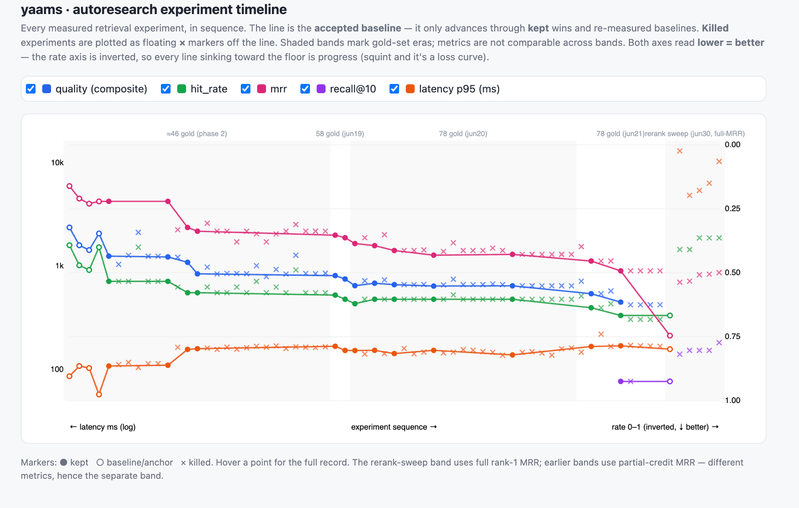

# Autoresearch experiment timeline

A self-contained view of every measured retrieval experiment in yaams: what was
tried, what was kept, what was killed, and how the metrics moved over time. The
point is institutional memory — don't re-try a dead idea, and don't mistake
noise for a trend.



> This module is deliberately dependency-free and self-contained so it can be
> lifted into its own repo later (like ux-loop). It assumes nothing about yaams
> except the two upstream TSV ledgers used for the one-time seed.

This page documents the record. How to *produce* one honest experiment (the
frozen fixture and its eras, the anchor and state file, the keep rule, the run
recipe, what to log by hand after a `--no-write` run) is the operator runbook
at [../retrieval-tuning.md](../retrieval-tuning.md).

## Files

| File | Role |
|------|------|
| `experiments.jsonl` | **Source of truth.** One experiment per line, append-only. |
| `index.html` | Self-contained viewer (hand-rolled SVG, zero deps). Opens via `file://`. |
| `log_experiment.py` | Append an experiment + rebuild. The one entry point — used by the harnesses and the CLI. |
| `build.py` | Inlines `experiments.jsonl` into `index.html`. Run by the logger; rarely run by hand. |
| `CURRENT_ERA` | One line: the gold-set version new experiments are tagged with. Bump on reseed. |
| `seed.py` | One-shot reconstruction of pre-2026-06-30 history from `scripts/autoresearch_*.tsv`. Provenance only. |
| `wiki/` | The persistent knowledge layer (WikiSkill, arXiv 2608.27454): consolidated `patterns.md`, append-only `evolution.md`, preserved proposal diffs in `proposals/`. See `wiki/README.md`. |
| `wiki.py` | Record one skill proposal (metadata + verdict + full diff) into the wiki. Used by the autoresearch loop for every experiment, rejected ones included. |

## View it

```sh
python docs/experiments/build.py      # refresh the inlined data
open docs/experiments/index.html      # no server needed
```

The line is the **accepted baseline** — it advances only through `keep` wins and
re-measured baselines. `kill` experiments are floating `×` markers off the line.
Shaded bands are gold-set eras; **metrics do not compare across bands** (the gold
set grew 46 → 58 → 78, and the rerank sweep uses full-MRR vs the campaigns'
partial-credit MRR).

## Harness preconditions

`scripts/autoresearch_retrieval.py` checks the gold set before it scores
anything. The metric code is off-limits; these are gates in front of it.

- **No junk gold.** After loading the gold set, every `result_id` is joined
  against `items.junk_reason` on the fixture in use. If any gold document is
  annotated junk (`mech:short`, `mech:dup`, `llm:junk`, ...), the harness
  prints each offender as `junk gold: <query> -> <result_id> (<reason>)` on
  stderr and exits 1 with `status: invalid_gold` (JSON: `{"status":
  "invalid_gold", "junk_gold": N, ...}`). Nothing is written to `results.tsv`,
  the state file or the timeline. Two junk gold rows silently inverted the
  `--exclude-junk` gate through three runs; this is the cheap guard from
  `.plans/done/data-quality.md`. Fix the gold set (or the annotation), or pass
  `--allow-junk-gold` to score anyway with a stderr warning. Consolidation
  golds (`cons:` ids) carry no annotation and never trip it; a fixture
  predating migration 0009 has no column and is treated as clean.
- **Some gold in the split.** An empty split is a crash, not a zero.

### Recency gold candidates (`scripts/recency_gold_candidates.py`)

Read-only companion for building a recency-sensitive gold slice
(`.plans/eval-gold-hygiene.md`). It replays the owner's short queries from the
live query log (`provenance='cli'`, at most 3 tokens, `ts` before 2026-09-16,
deduped by lowercased text; 113 queries on the live db, the archived
recency-lane plan reported 79 with an unrecorded filter) FTS-only with
`recency_lane_days=60` and `recency_now` pinned to each query's own `ts`, and
writes the top-5 hits dated within 60 days before the query as TSV
(`query, rank, item_id, ts, snippet, query_id, query_ts`) to
`~/brain/feed/eval/recency_candidates.tsv`. The owner marks the wanted row per
query; `query_id` is what the apply step files the mark under. `--db`, `--out`,
`--days`, `--top`, `--max-tokens`, `--before` override the defaults. The db
is opened `mode=ro`.

## Add an experiment (the rule)

Every run that measures `quality` / `hit_rate` / `mrr` / `recall@10` /
`latency_p95_ms` gets a line — win or lose.

**Automatic:** `scripts/autoresearch_retrieval.py` (recorded runs) and
`scripts/rerank_sweep.py` already call `log_experiment.py` for you. Nothing to do.

**Manual / ad-hoc:** use the logger (it appends and rebuilds):

```sh
python docs/experiments/log_experiment.py --key my_idea --disposition kill \
  --quality 0.62 --hit-rate 0.667 --mrr 0.49 --recall10 0.92 --latency-p95 171 \
  --note "why it failed"
```

- `disposition`: `keep` (new accepted baseline) · `kill` (rejected) · `baseline` (re-measure / anchor). Record the **final** disposition — a win later reverted as overfit is a `kill`.
- `era`: defaults to `CURRENT_ERA`; bump that file whenever the gold set or metric definition changes.
- Omit any metric you didn't measure; the viewer skips gaps.
- A git pre-commit hook rebuilds `index.html` if you hand-edit `experiments.jsonl`.

## The wiki layer (consolidated knowledge)

The timeline is the **raw layer**: every measured run, win or lose. The
**wiki** (`wiki/`) sits above it as the persistent, consolidated layer,
after WikiSkill (arXiv 2608.27454): `patterns.md` distills cross-experiment
patterns the planner must read before proposing, `proposals/` preserves every
proposal's full diff with its verdict so failed attempts are never repeated
blind, and `evolution.md` indexes them. The wiki persists across rejected
skill updates - a discarded experiment still compounds knowledge.

Record a proposal (the loop's recorder step does this for every experiment):

```sh
python docs/experiments/wiki.py --key my_idea --verdict discarded \
  --quality 0.62 --delta 0.0 --round 3 --note "why" --diff-file /tmp/my_idea.diff
```

- `verdict`: `kept` · `discarded` · `crashed` · `apply-failed` · `parked`.
- Proposal files are immutable once written; a later revert gets a new entry.
- Consolidation into `patterns.md` is the wiki maintainer's job (a per-round
  step in `scripts/autoresearch_loop.workflow.js`); patterns are
  append-mostly and never deleted or weakened.

### Why log every run, not just the wins

The harness records *every* recorded run, so the timeline grows fast during an
active campaign — each parameter trial is one `×`. That's deliberate: the cloud
of kills around the accepted-baseline line is the point. It shows how well the
current baseline holds up against everything we threw at it, and stops us
re-trying dead ideas. We keep them all. If a campaign ever makes it too noisy to
read, toggle individual metrics off rather than dropping points.
